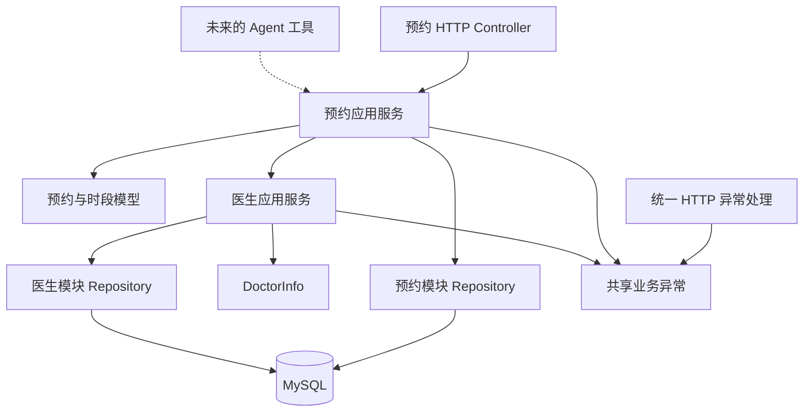

# 架构与阅读指南

项目采用 **模块化单体 + 按业务分包 + 模块内轻量分层**。所有代码在一个 Maven 工程中，构建、部署一个应用；通过包结构和明确的调用规则区分业务职责。

## 业务模块如何划分

| 模块 | 拥有的业务 | 提供的能力 |
| --- | --- | --- |
| `doctor` | 医生资料 | 创建、查询医生；为排班锁定医生记录 |
| `appointment` | 排班时段、预约、取消、占用规则 | 发布时段、查询可用性、创建和取消预约 |
| `shared` | 各模块共用的错误定义与 HTTP 错误转换 | 业务异常、统一错误响应 |

`shared` 保持小范围，不承载医生或预约业务。以后接入 Agent 时再创建相应模块，由工具调用应用服务；当前没有空的 Agent 模块。

### 为什么时段与预约属于同一个模块

时段的可用性由预约状态决定；创建预约需要锁定时段，取消预约也要与同一时段上的预约操作协调。如果按表拆成排班模块和预约模块，就容易出现“排班查预约、预约查排班”的双向依赖。

当前将这组规则放在 `appointment` 中，既能集中阅读，也能清晰控制事务。以后若出现独立的排班产品、多个业务使用同一套排班或更复杂的容量管理，再依据实际需求调整边界。

## 每层负责什么

```text
com.op1ed.appointmentmanager
├── AppointmentManagerApplication
├── doctor
│   ├── web
│   ├── application
│   ├── domain
│   └── infrastructure
│       └── persistence
├── appointment
│   ├── web
│   ├── application
│   ├── domain
│   └── infrastructure
│       └── persistence
└── shared
    ├── error
    └── web
```

| 层 | 负责什么 | 预约中的例子 |
| --- | --- | --- |
| `web` | HTTP 路径、JSON、输入格式校验、响应转换 | Controller、请求和响应 DTO |
| `application` | 一次业务用例的流程、业务输入、事务边界 | 创建预约、发布时段、取消预约 |
| `domain` | 业务对象及其自身行为 | 预约、时段、预约状态、取消行为 |
| `infrastructure.persistence` | 具体数据库访问 | JPA Repository、带行锁的查询 |

`CreateAppointmentRequest` 是 HTTP 请求 DTO；Controller 将它转为 `BookAppointmentCommand`，调用预约应用服务。应用服务返回 `AppointmentResult`，再由 HTTP 响应 DTO 的 `from` 方法转换为原有 JSON。

时段创建同样使用 `CreateSlotCommand` 与 `SlotResult`，医生创建使用 `CreateDoctorCommand` 与 `DoctorInfo`。Command 和 Result 都放在本模块的 `application` 包中。预约与时段结果的时间字段保存 `Instant`，HTTP 响应转换时输出 UTC 的 `OffsetDateTime`。这样业务流程不需要知道 JSON 字段校验注解、HTTP 状态码或响应对象。

应用服务负责资源存在、时段有效和占用情况等业务校验。HTTP 格式校验是入口的便利，业务规则仍要保护未来的 Agent 等调用入口。

### 当前分层的取舍

这是轻量分层：

- 业务模型继续使用 JPA 实体注解，一套对象承担业务表达与持久化映射。
- 应用服务直接调用本模块的 JPA Repository。
- 不为每个服务建立只有一个实现的接口。
- 不增加 Maven 子模块、事件总线或远程服务调用。

因此，这个项目没有宣称领域层完全独立于框架，也没有完整实现依赖倒置。先把真实职责、业务规则和事务边界建立清楚，后续需求需要替换数据库或分离模型时，再增加相应接口与映射。

## 依赖规则



遵循以下规则：

1. `web` 调用 `application`，应用服务不依赖 Controller 或 HTTP DTO。
2. 应用服务可以访问本模块的领域模型和 Repository。
3. `appointment` 通过 `doctor.application.DoctorService` 使用医生能力，拿到普通 record `DoctorInfo`；不导入医生实体或 Repository。
4. `doctor` 不依赖 `appointment`，避免业务模块循环依赖。
5. `domain` 不调用 Controller、应用服务或其他模块的 Repository。
6. 业务代码使用 `shared.error` 中的业务异常，`shared.web` 把错误转换为 HTTP ProblemDetail。
7. Agent 工具将来调用应用服务，共用规则与事务，不直接操作 Repository。

架构测试用于检查这些边界，防止后续开发逐渐绕过约定。

## 一次创建预约如何执行

客户端先创建医生、发布时段，取得真实 `slotId`，再发送：

```json
{
  "customerName": "张三",
  "slotId": 12
}
```

创建预约的流程：

1. Controller 对 HTTP 输入做格式校验，转成 `BookAppointmentCommand`。
2. 预约应用服务开启事务，第一条数据库查询锁住目标时段。
3. 检查时段存在且尚未开始。
4. 通过医生应用服务取得医生信息。
5. 检查该时段是否存在 `BOOKED` 预约。
6. 创建预约，保存用户姓名、时段 ID、医生姓名与起止时间。
7. 保存并刷新数据，数据库唯一索引检查有效预约约束。
8. 返回业务结果；事务提交后释放行锁，Controller 转换为响应。

两个请求预约同一个时段时，后一个请求等待行锁。前一个事务提交后，后一个再检查占用情况，返回冲突。时段列表中 `available=true` 只是读取当时的状态，不能代替这个事务内检查。

### 数据库约束如何保留取消历史

预约表的 `active_slot_id` 是数据库生成列：`BOOKED` 时等于 `slot_id`，取消时为 `NULL`。唯一索引限制同一个时段只存在一条有效预约，允许多条取消记录。

取消只修改指定预约的状态。重新预约创建一条新记录，因此再次取消旧预约不会影响新预约。取消和预约使用同一时段的行锁协调操作。

V3 以前的练习记录仍保留。它们的 `slot_id`、`end_time` 为空，可以查询和取消，但不占用新发布的时段。响应转换需要保留对空结束时间的处理。

## 跨模块调用不能破坏事务

发布时段时，需要锁住医生记录，再查询重叠时段，最后保存新时段：

```text
排班应用服务开启事务
    → DoctorService.lockForScheduling(doctorId)
    → 查询是否重叠
    → 保存时段
排班事务提交并释放医生锁
```

`lockForScheduling` 使用 `Propagation.MANDATORY`，要求调用方已有事务，并加入该事务。如果脱离事务单独调用，会直接失败。

这里不另开事务：如果医生服务返回时就提交并释放医生锁，两个排班请求仍可能同时通过重叠检查。普通读取医生使用 `requireById`，不申请排班锁。

移动包路径时，这些事务与查询顺序都要保留。包结构不会自动保证并发正确性，必须由事务、锁、数据库约束和测试共同验证。

## 错误如何从业务层到 HTTP

业务层使用业务异常表达非法输入、资源不存在或业务冲突，异常带稳定的 `code` 与中文说明。`INVALID_ARGUMENT`、`NOT_FOUND`、`CONFLICT` 分别表达这三类情况。它不抛 `ResponseStatusException`，也不选择 HTTP 状态码。

统一异常处理将错误映射为 400、404 或 409，并返回 ProblemDetail。HTTP 校验或无法读取请求 JSON，也由 HTTP 层给出统一错误响应。

成功接口的路径和 JSON 保持原样，错误响应则明确提供错误类型。以后 Agent 工具可以依据同一个业务错误判断如何回复、是否重新查询时段，而无需处理 HTTP 特有异常。

## 建议的阅读顺序

1. 从预约 Controller 看输入输出，再看 `BookAppointmentCommand` 和 `AppointmentResult`，理解入口与业务的交接。
2. 阅读 [预约应用服务](../src/main/java/com/op1ed/appointmentmanager/appointment/application/AppointmentService.java) 的创建方法，沿着事务、行锁、占用查询、保存的顺序画出流程。
3. 阅读 `Appointment`、`AppointmentSlot`、`AppointmentStatus`，区分对象自身行为与跨对象协调。
4. 阅读本模块 Repository 与 V3 迁移，理解代码检查和数据库约束各自保证什么。
5. 阅读 [医生应用服务](../src/main/java/com/op1ed/appointmentmanager/doctor/application/DoctorService.java)，重点看普通读取与 `lockForScheduling` 的区别。
6. 阅读排班创建和取消逻辑，检查锁在什么时候获取、在什么时候释放。
7. 阅读 [统一异常处理](../src/main/java/com/op1ed/appointmentmanager/shared/web/GlobalExceptionHandler.java)，跟踪一个业务冲突如何变成 HTTP 响应。
8. 最后阅读集成测试与架构测试，理解它们分别检查行为和依赖边界。

先能解释一个完整流程，再扩展分页、用户身份和 Agent 工具。目录结构的价值是帮助维护这些规则，而不是让项目拥有更多文件夹。
